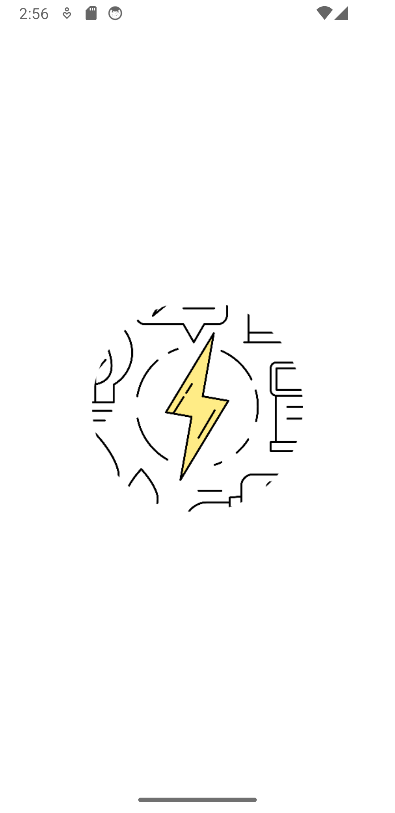
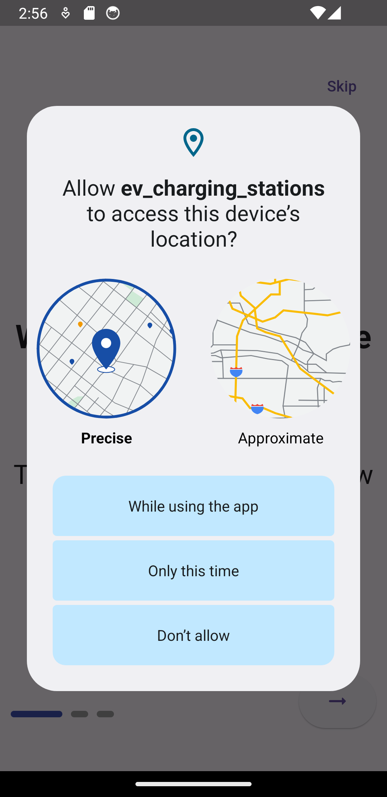
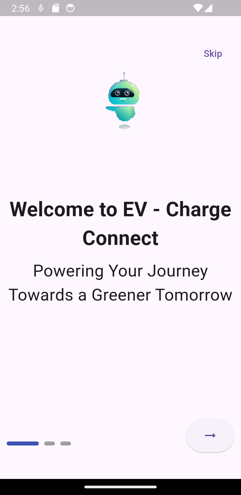
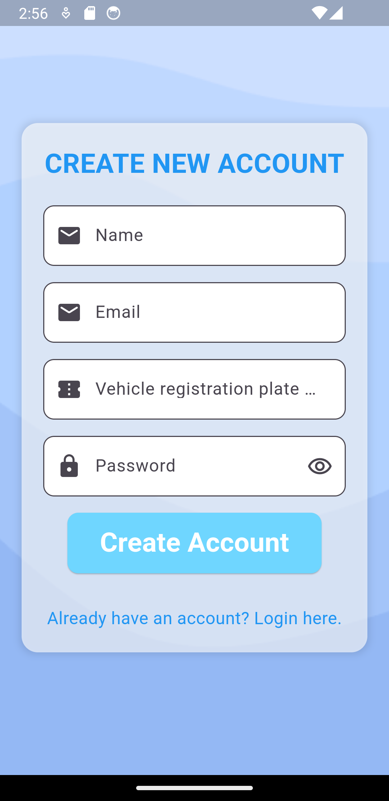
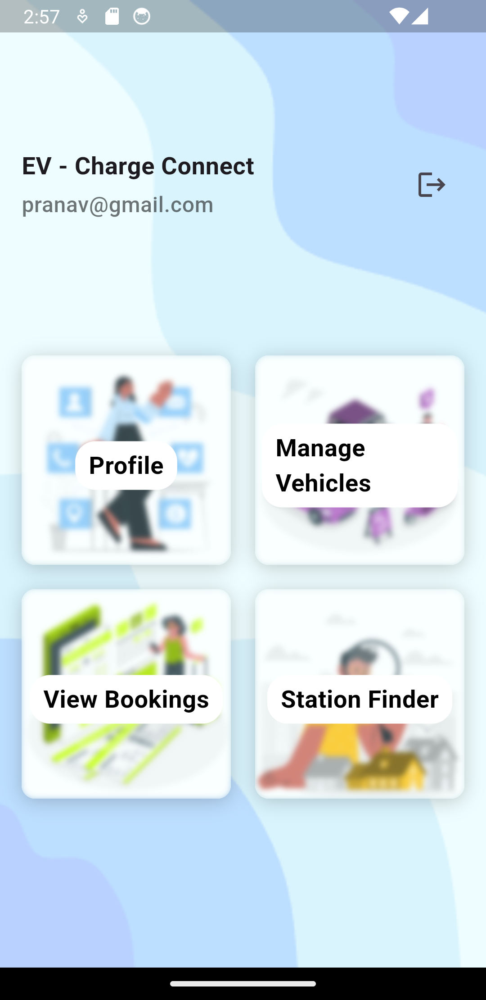
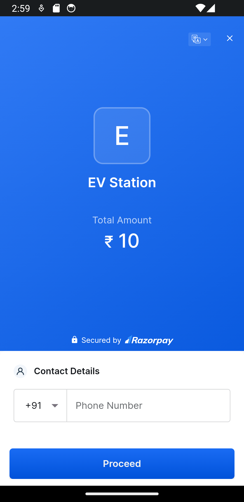
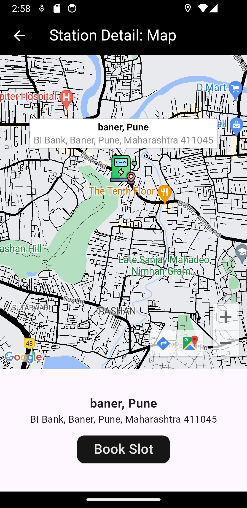

# EV Charging Station Locator App

## Description

The EV Charging Station Locator App is a cross-platform mobile application developed using Flutter. It enables electric vehicle owners to conveniently find nearby charging stations, check their availability, status, and even pre-book slots for charging. The app includes a payment gateway for seamless transactions, offering enhanced convenience and engagement for users.

Key features of the app include:

- **Cross-Platform Compatibility:** Built with Flutter for full compatibility on both Android and iOS devices.
- **User-Friendly Interface:** Intuitive design for easy navigation and quick access to essential features.
- **Real-Time Updates:** Provides real-time information on the availability and status of nearby charging stations.
- **Slot Pre-Booking:** Allows users to reserve charging slots in advance, optimizing their charging experience.
- **Integrated Payment Gateway:** Facilitates secure and seamless transactions directly within the app.

## Project Screenshots

Here are some screenshots of the application:
<!-- 

 -->

<table>
  <tr>
    <td></td>
    <td></td>
  </tr>
  <tr>
    <td></td>
    <td></td>
  </tr>
  <tr>
    <td></td>
    <td></td>
  </tr>
  <tr>
    <td></td>
    <td></td>
  </tr>
</table>

For more screenshots, visit the [screenshots folder](ScreenShots/).

## Installation

To run the app locally, follow these steps:

1. Clone the repository:
git clone https://github.com/pranavgaikwadcodes/ev_charging_station.git

2. Navigate into the project directory:
`cd ev_charging_station`

3. Install dependencies:
`flutter pub get`

4. Run the app:
`flutter run`

## Contributing

Contributions are welcome! If you find any issues or have suggestions for improvement, please open an issue or a pull request in this repository.

## License

This project is licensed under the [License Name, e.g., MIT License]. See the LICENSE file for details.

<!-- Replace License Name with the appropriate license for your project -->

## Acknowledgements

- Mention any libraries, frameworks, or third-party assets used in your project.

## Contact

- Your Name
- Contact Information
- Additional links or contact information as needed

